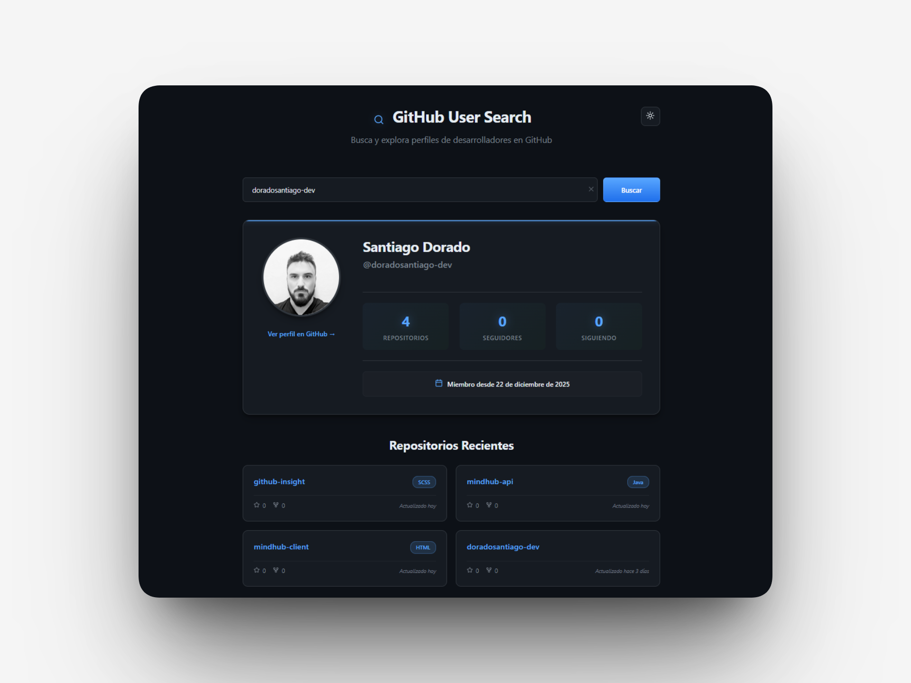
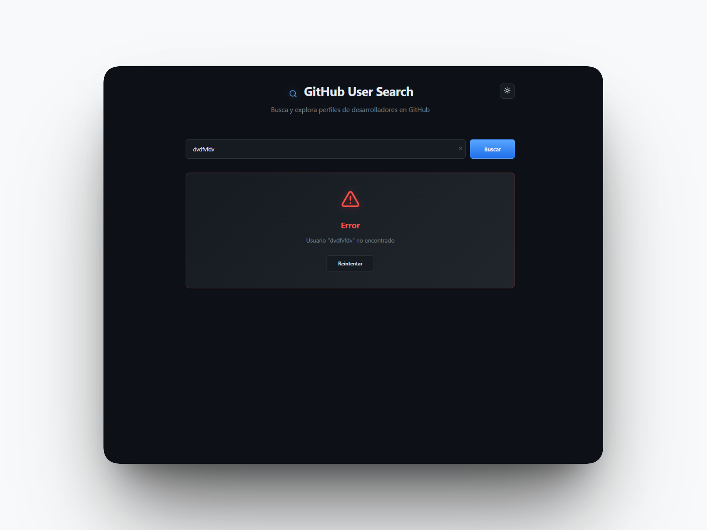
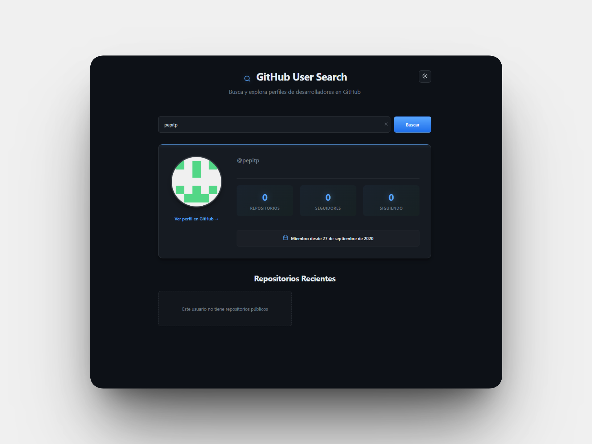

# GitHub Insight

> **A high-performance reactive search platform built with Angular 21, leveraging a Signal-based architecture for fine-grained state management and @defer blocks for optimized, non-blocking data loading.**

[](https://angular.io/)
[](https://www.typescriptlang.org/)

<p align="center">
  
</p>

## Technical Highlights

* **Fine-Grained Reactivity with Signals**: Implemented a modern state management architecture using **Angular Signals** (`signal`, `computed`, and `effect`). This ensures targeted, high-performance UI updates by bypassing traditional heavy change detection cycles.

* **Smart Resource Management (@defer)**: Leveraged Angular 21's native **Deferred Loading** to optimize Core Web Vitals. By prioritizing critical profile data and lazy-loading the repository list, the application achieves a near-instant perceived load time.

* **Advanced Theming Engine**: Developed a robust theme-switching service with **CSS Custom Properties** (Variables) and `localStorage` persistence. This allows for a seamless, flicker-free transition between Dark and Light modes while respecting user preferences.

* **Modern Control Flow & Standalone Architecture**: Utilized the latest **declarative syntax** (`@if`, `@for`, `@empty`) for cleaner, more readable templates and a fully **Standalone** component structure to minimize bundle size and overhead.

## Visual Overview

### Adaptive UI (Theming)

Dark Mode (Default) | Light Mode |
| :---: | :---: |
|  |  |

### Resilience & User Feedback

| User Not Found (404) | Empty Repository State |
| :---: | :---: |
|  |  |

## Tech Stack

* **Core Framework**: Angular 21 (Latest Stable)
* **Architecture**: Standalone Components & Signal-based State Management
* **Language**: TypeScript 5.x
* **Styling & UI**: 
  * **SCSS (Sass)** for advanced styling
  * **CSS Custom Properties** for dynamic theming
  * **Responsive Grid/Flexbox** Layouts
* **Data Fetching**: Angular `HttpClient` with RxJS & Signals integration
* **External API**: GitHub REST API
* **Dev Tools**: Angular CLI, Git for version control

## Getting Started

Follow these steps to set up the project locally:

1. **Clone the repository**:
   ```bash
   git clone [https://github.com/tu-usuario/github-insight.git](https://github.com/tu-usuario/github-insight.git)
   ```

2. **Navigate to the project folder**:
   ```bash
   cd github-insight
   ```

3. **Install dependencies**:
   ```bash
   npm install
   ```

4. **Run the development server**:
   ```bash
   ng serve
   ```

5. **Access the application: Open your browser and navigate to http://localhost:4200/**

## License

This project is open-sourced software licensed under the MIT license. Based on official Open Source Initiative standards, this allows for personal and commercial use with attribution.